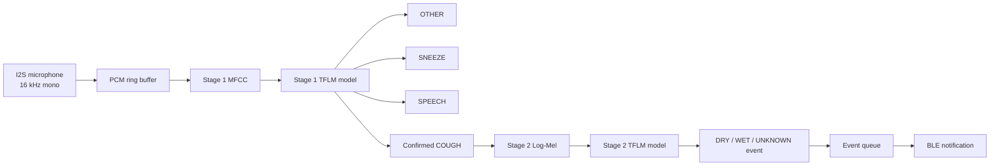

# BreathSense xG26 Firmware

BreathSense is an embedded acoustic monitoring prototype for the Silicon Labs
EFR32MG26 platform.

The firmware continuously captures microphone audio and runs a two-stage
TensorFlow Lite for Microcontrollers pipeline:

1. Stage 1 detects `COUGH`, `SNEEZE`, `SPEECH`, or `OTHER`.
2. Stage 2 runs only after a confirmed cough and classifies it as `DRY`, `WET`,
   or `UNKNOWN`.

The device also measures temperature and relative humidity using an
Si7021-compatible sensor and publishes cough events and environmental data
through Bluetooth Low Energy GATT notifications.

> BreathSense is an engineering and research prototype. It is not a certified
> medical device and must not be used for diagnosis or medical decision-making.

## Features

- Continuous 16 kHz mono microphone capture
- TensorFlow Lite Micro inference on EFR32MG26
- Two-stage acoustic classification
- Configurable confidence thresholds and temporal filtering
- Dry/wet cough classification
- Si7021 temperature and humidity measurements
- Bluetooth LE peripheral with custom GATT service
- Event-driven Micrium OS tasks
- Cough event queue for temporary BLE disconnections
- VCOM debug output at 115200 baud
- MVP-accelerated TensorFlow Lite kernels

## Target hardware

- Silicon Labs EFR32xG26 Development Kit
- Board: BRD2608A
- MCU: EFR32MG26B510F3200IM68
- On-board I2S microphone
- Si7021-compatible temperature and humidity sensor
- VCOM serial interface

## Software requirements

- Simplicity Studio 6
- Simplicity SDK Suite `2025.12.3`
- Silicon Labs AI/ML SDK Extension `2.2.2`
- GNU Arm Embedded toolchain
- CMake and Ninja supplied by Silicon Labs

The project configuration is defined in
[`BreathSense_xG26_Node_V2.slcp`](BreathSense_xG26_Node_V2.slcp).

## AI pipeline



### Stage 1

Stage 1 processes:

- Sample rate: 16 kHz
- Channels: 1
- Audio chunk: 1,600 samples or 100 ms
- Inference window: 25,600 samples or 1.6 seconds
- Window stride: 12,800 samples or 0.8 seconds
- Classes: `COUGH`, `OTHER`, `SNEEZE`, and `SPEECH`

The Stage 1 thresholds, audio gate, temporal confirmation, and debug logging
are configured in
[`breathsense_ai_product_config.h`](breathsense_ai_product_config.h).

### Stage 2

Stage 2 is executed only when Stage 1 confirms a new cough event.

It applies Log-Mel feature extraction to the same PCM window and classifies the
event as:

| Value | Cough type |
|---:|---|
| `0` | Unknown or rejected |
| `1` | Dry cough |
| `2` | Wet cough |

A minimum score margin is used to reject uncertain Stage 2 results.

## Runtime architecture

The firmware is event-driven and uses Micrium OS:

- The microphone callback writes audio chunks into a ring buffer.
- The AI task waits for audio-ready event flags.
- The sensor task waits for a software timer event.
- The BLE TX task waits for cough, environment, or BLE-state event flags.
- Confirmed cough events are stored in an eight-entry queue.
- The latest environmental sample is cached until it can be transmitted.

The application does not perform continuous polling in `app_process_action()`.

## Bluetooth LE interface

The current advertised device name is:

```text
MyDevice_01
```

### BreathSense service

| Item | UUID |
|---|---|
| BreathSense Service | `b5e00001-7a4b-4c6d-9e10-112233445566` |
| Cough Event | `b5e00002-7a4b-4c6d-9e10-112233445566` |
| Environment Data | `b5e00003-7a4b-4c6d-9e10-112233445566` |

Both characteristics support BLE notifications.

### Cough event payload

The Cough Event characteristic contains eight bytes:

| Byte | Description |
|---:|---|
| `0` | Flags, currently `0` |
| `1` | Cough type: `0` unknown, `1` dry, `2` wet |
| `2..5` | Event timestamp, currently `0` |
| `6..7` | Event counter, unsigned little-endian |

### Environment payload

The Environment Data characteristic contains four bytes:

| Byte | Description |
|---:|---|
| `0..1` | Temperature × 100, signed little-endian `int16` |
| `2..3` | Relative humidity × 100, unsigned little-endian `uint16` |

For example, a decoded temperature value of `2811` represents `28.11 °C`.

## Build and flash

### Simplicity Studio

1. Install Simplicity SDK Suite `2025.12.3` and AI/ML extension `2.2.2`.
2. Open `BreathSense_xG26_Node_V2.slcp`.
3. Confirm that BRD2608A is selected as the target.
4. Generate the project if required.
5. Build the project.
6. Connect the development board through USB.
7. Flash the generated firmware.
8. Open the VCOM console using `115200 8-N-1`, without flow control.

A successful startup should include messages similar to:

```text
BLE: stack booted
BLE: connectable advertising started
Si7021 task started: event-driven
Si7021 detected
BLE TX task started: event-driven OSFlagPend
Stage2 runtime ready
AI READY: Stage1=COUGH,OTHER,SNEEZE,SPEECH Stage2=DRY,WET
```

### CMake

Run the commands from a Silicon Labs development environment containing the
required CMake, Ninja, Arm GCC, SDK, and extension paths:

```powershell
cd cmake_gcc
cmake --preset project
cmake --build --preset default_config
```

Generated firmware files are placed in:

```text
cmake_gcc/build/base/
```

Available output formats include `.s37`, `.hex`, `.bin`, and `.out`.

## Testing

Recommended validation scenarios:

1. Quiet room with no target events
2. Live cough at several distances
3. Dry and wet cough samples
4. Sneezing and speech
5. Music, television, fan, keyboard, and background conversation
6. Audio played from a phone or computer speaker
7. BLE connection, disconnection, and reconnection
8. Cough notification and environment notification decoding

Record false positives, missed events, confidence values, microphone levels,
distance, playback device, and background conditions during testing.

Playback audio can behave differently from a live cough because of speaker,
microphone, room, and training-data characteristics. Threshold changes alone
cannot guarantee better far-field performance.

## Configuration

Product-level AI settings are located in:

```text
breathsense_ai_product_config.h
```

Set:

```c
#define BS_AI_DEBUG_RAW_LOGS 1u
```

during model validation to print raw probabilities and audio levels. Set it to
`0u` for normal operation to reduce serial output.

After changing microphone gain, board hardware, or the enclosure, recalibrate
the audio gate and validate the model again.

## Repository structure

```text
.
├── app.c
├── breathsense_ai_live.cc
├── breathsense_ai_product_config.h
├── breathsense_ble*.c
├── breathsense_sensor.c
├── breathsense_*_runtime.cc
├── src/
│   ├── core/
│   └── indicator/
├── config/
├── autogen/
├── cmake_gcc/
└── BreathSense_xG26_Node_V2.slcp
```

## Current limitations

- The model is not validated for medical use.
- Far-field accuracy depends on distance, room acoustics, and background noise.
- Audio played through external speakers may differ from live cough audio.
- The BLE cough timestamp field is currently not synchronized and remains zero.
- Stage 2 currently reports raw scores and a decision margin rather than a
  calibrated confidence percentage.
- Model performance must be evaluated on a larger, representative test set.

## License

No license has been selected yet. Add a `LICENSE` file before distributing or
accepting external contributions.